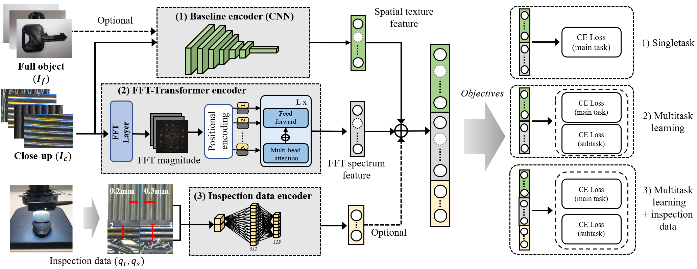

### SI3DP++ project page

B. S. Shim, J. H. Choe and J. -U. Hou, "Source Identification of 3D Printer Based on Layered Texture Encoders," in IEEE Transactions on Multimedia, doi: 10.1109/TMM.2022.3233764.


Dataset will be available after publication.
Please refer our previous work [SI3DP](https://github.com/juhou/SI3DP)





## Abstract

With the rapid growth in the 3D printing content market, various unprecedented criminal cases and copyright protection issues are emerging. In response to this imminent and emergent difficulty, we propose a forensic technique for identifying the source of 3D printed products based only on the surface image with no additional tools. This is used to develop database and benchmarks to be used for tracing and finding the sources and origins of 3D printing objects. In fact, the surface texture of 3D printed objects presents, inevitably, very fine periodic traces owing to hardware characteristics during the manufacturing process. We systematically analyzed the causes and factors related to these fine features, and propose a technology using them as unique fingerprints for specific 3D printed objects. As benchmarks, we obtained microscopic close-up images and full-object images from 464 printed objects from 29 different printing options. A certain level of performance was achieved using six benchmarks including printer, and device-level identification. We improved the classification performance to an accuracy of 95\% by using additional inspection information. Moreover, we extended the baseline study based on the benchmark set to forensic test scenarios from multiple perspectives in preparation for real situations. Finally, we deformed 3D printed objects and applied our approach to validate post-processing situations to avoid source identification. We reveal both the dataset and detailed experimental design to provide an opportunity to facilitate future in-depth research related to forensics and protection of intellectual property. 


## Setup

- Python 3.7.0 ~ 3.7.9
- CUDA Version 11.0

1. Nvidia driver, CUDA toolkit 11.0, install Anaconda.

2. Install pytorch 
        
        conda install pytorch torchvision cudatoolkit=11.0 -c pytorch

3. Install various necessary packages in requirements.txt

        pip install -r requirements.txt

## Dataset


### Download Dataset

Sign up through the link below to receive Dataset and csv.

### [Register link](https://forms.gle/링크첨부)

----

Download [7zip](https://www.7-zip.org) and unzip your dataset. Create a `data` folder with `SI3DPpp` folder as a sub-path.

Please move the full shot and close-up dataset folders in the SI3DP folder.

Based on the `./data` sub-path `SI3DPpp/{train_close,train_full,train_close.csv,train_full.csv}`

------
        
## Training
When using Terminal, directly execute the code below after setting the path

        python train.py --enet-type CFTNet --n-epochs 20 --batch-size 32 --task-type P --img-type close

When using pycharm:

        Menu Run 
        -> Edit Configuration 
        -> Check train.py in Script path
        -> Go to parameters and enter the following

        --enet-type CFTNet --n-epochs 20 --batch-size 32 --task-type P --img-type close

        -> Running/debugging after check Apply button

As training progresses, the best and final weights are saved in the folder `./weights/`. Learning logs are saved in the `./logs/` folder.

The order of side task type and task type is P : Printer, F : Filament, Q-T : Layer thickness, Q-S : Number of shells, R : Reprint.
### Single Task 
- Printer task
        
        python train.py --enet-type CFTNet --n-epochs 20 --batch-size 32 --task-type P --img-type close
        
- Filament task
        
        python train.py --enet-type CFTNet --n-epochs 20 --batch-size 32 --task-type F --img-type close
        
- Layer thickness task
        
        python train.py --enet-type CFTNet --n-epochs 20 --batch-size 32 --task-type Q-T --img-type close
        
- Number of shells task
        
        python train.py --enet-type CFTNet --n-epochs 20 --batch-size 32 --task-type Q-S --img-type close
        
- Device task 
        
        python train.py --enet-type CFTNet --n-epochs 20 --batch-size 32 --task-type D --img-type close

- Reprint task
        
        python train.py --enet-type CFTNet --n-epochs 20 --batch-size 32 --task-type R --img-type close

       
### Multi-task task setting
- Multi-Task(Device & Printer)
        
        python train.py --enet-type CFTNet --task-type D --img-type close --side-task-type P --batch-size 32 --n-epochs 20

- Multi-Task(Device & Layer thickness)
        
        python train.py --enet-type CFTNet --task-type D --img-type close --side-task-type Q-T --batch-size 32 --n-epochs 20

-Set according to the combination of "--task-type" and "--side-task-type". 
       
### (Multi or Single) Modal-Task  Setting
- Single-Modal-Task(Device)
        
        python train.py --enet-type CFTNet --task-type D --img-type both --batch-size 32 --n-epochs 20
        
- Multi-Modal-Task(Device & Printer)
        
        python train.py --enet-type CFTNet --task-type D --img-type both --side-task-type P --batch-size 32 --epoch 20
        
- Multi-Modal-Task(Device & Printer & Inspection data)
        
        python train.py --enet-type CFTNet --task-type D --img-type both --side-task-type P --batch-size 32 --epoch 20 --use-meta

### Semi-Controlled Setting
- Multi-Modal-Task(Printer & Number of shells)
        
        python train.py --enet-type CFTNet --task-type P --img-type both --side-task-type Q-S --batch-size 32 --epoch 20 --semi

- Multi-Modal-Task(Device & Layer thickness)
        
        python train.py --enet-type CFTNet --task-type D --img-type both --side-task-type Q-T --batch-size 32 --epoch 20 --semi

### Post-Processing Setting
- Sanding-Processing-Task
        
        python train.py --enet-type CFTNet --n-epochs 20 --batch-size 32 --task-type P --img-type close --sanding-processing
        
- Coating-Processing-Task
        
        python train.py --enet-type CFTNet --n-epochs 20 --batch-size 32 --task-type P --img-type close --coating-processing

### Fullshot Setting (Baseline only)
- Printer/Filament/Layer thickness/Number of shells/Device/Reprint task
        
        python train.py --enet-type tf_efficientnet_b3_ns --n-epochs 20 --batch-size 32 --task-type P/F/Q-T/Q-S/D/R --img-type full --baseline

## Evaluating

The learned model is subjected to k-fold cross validation. You can use the model used for training earlier, or you can evaluate it by specifying the model in --model-dir.

The evaluation results are saved in ./logs/.
        
### Single Task
- Printer/Filament/Layer thickness/Number of shells/Device/Reprint task
        
        python evaluate.py --enet-type CFTNet --n-epochs 20 --batch-size 32 --task-type P/F/Q-T/Q-S/D/R --img-type close

### Multi-task task setting
- Multi-Task(Device & Printer)
        
        python evaluate.py --enet-type CFTNet --task-type D --img-type close --side-task-type P --batch-size 32 --n-epochs 20

- Multi-Task(Device & Layer thickness)
        
        python evaluate.py --enet-type CFTNet --task-type D --img-type close --side-task-type Q-T --batch-size 32 --n-epochs 20

-Set according to the combination of "--task-type" and "--side-task-type". 
       
 ### (Multi or Single) Modal-Task  Setting
- Single-Modal-Task(Device)
        
        python evaluate.py --enet-type CFTNet --task-type D --img-type both --batch-size 32 --n-epochs 20
        
- Multi-Modal-Task(Device & Printer)
        
        python evaluate.py --enet-type CFTNet --task-type D --img-type both --side-task-type P --batch-size 32 --epoch 20
        
- Multi-Modal-Task(Device & Printer & Inspection data)
        
        python evaluate.py --enet-type CFTNet --task-type D --img-type both --side-task-type P --batch-size 32 --epoch 20 --use-meta

### Semi-Controlled Setting
- Multi-Modal-Task(Printer & Number of shells)
        
        python evaluate.py --enet-type CFTNet --task-type P --img-type both --side-task-type Q-S --batch-size 32 --epoch 20 --semi

- Multi-Modal-Task(Device & Layer thickness)
        
        python evaluate.py --enet-type CFTNet --task-type D --img-type both --side-task-type Q-T --batch-size 32 --epoch 20 --semi

### Post-Processing Setting
- Sanding-Processing-Task
        
        python evaluate.py --enet-type CFTNet --n-epochs 20 --batch-size 32 --task-type P --img-type close --sanding-processing
        
- Coating-Processing-Task
        
        python evaluate.py --enet-type CFTNet --n-epochs 20 --batch-size 32 --task-type P --img-type close --coating-processing

### Fullshot Setting (Baseline only)
- Printer/Filament/Layer thickness/Number of shells/Device/Reprint task
        
        python evaluate.py --enet-type tf_efficientnet_b3_ns --n-epochs 20 --batch-size 32 --task-type P/F/Q-T/Q-S/D/R --img-type full --baseline

        
        
## Citation 

If you want to cite our Datasets [paper](https://ieeexplore.ieee.org/abstract/document/10005625) and code, you can use a bibtex code here:

```bibtex
@article{shim2023source,
  title={Source Identification of 3D Printer Based on Layered Texture Encoders},
  author={Shim, Bo Seok and Choe, Jae Hong and Hou, Jong-Uk},
  journal={IEEE Transactions on Multimedia},
  year={2023},
  publisher={IEEE}
}
```


